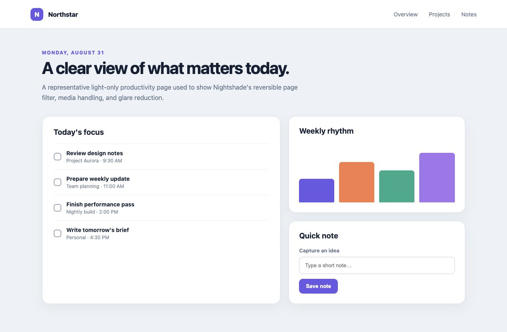
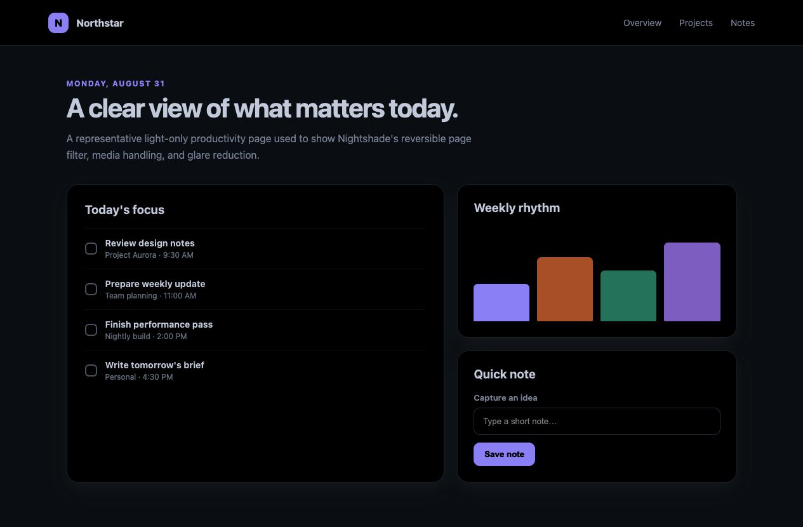

# Nightshade — Dark Mode Anywhere

<p align="center">
  
</p>

[](https://github.com/TimelyToga/nightshade-dark-mode/actions/workflows/ci.yml)
[](LICENSE)

Nightshade is a small Chrome extension that adds a reversible dark mode to websites that do not provide one. It automatically leaves native dark themes alone and provides per-site controls for the exceptions.

> Nightshade is currently distributed as an unpacked extension through GitHub Releases. It is not yet available in the Chrome Web Store.

## Features

- Darkens light websites automatically.
- Detects and skips many native dark themes.
- Preserves photos, videos, and multicolor artwork by default.
- Supports per-site on/off, dimming, and media overrides.
- Can pause itself everywhere for 15 minutes to 24 hours.
- Stores settings with Chrome Sync and has no analytics or external service.

## What it looks like

| Original page | Nightshade enabled |
| --- | --- |
|  |  |

## Install

### From a GitHub release

1. Download `nightshade-dark-mode.zip` from the [latest release](https://github.com/TimelyToga/nightshade-dark-mode/releases/latest).
2. Extract the ZIP to a permanent folder. Chrome cannot load the ZIP directly.
3. Open `chrome://extensions` in Chrome.
4. Enable **Developer mode**.
5. Select **Load unpacked** and choose the extracted folder containing `manifest.json`.

When updating, replace the extracted files, select Nightshade's reload button on `chrome://extensions`, and refresh open website tabs.

### From source

Nightshade has no runtime or development dependencies beyond Node.js 24 and the `zip` command.

```sh
git clone https://github.com/TimelyToga/nightshade-dark-mode.git
cd nightshade-dark-mode
npm test
npm run build
```

Load `dist/nightshade-dark-mode` from `chrome://extensions`. The build also creates `dist/nightshade-dark-mode.zip`.

## Controls

The compact popup separates your saved site mode from what Nightshade is actually doing on the page.

- **Auto / Always / Never** follows your global default and native-dark detection, forces Nightshade on, or excludes the current hostname.
- **Back to Auto** clears only the mode override. Custom dimming and media preferences are retained.
- **Appearance** expands dimming and media controls while Nightshade is active. Each field shows Default or Custom and has its own reset.
- **Undo** restores the last site-field change while the popup remains open.
- **Pause everywhere** opens duration presets from 15 minutes to 24 hours. Pausing overrides every site rule; the banner offers Resume now and +1 hour.
- **Refresh tab** appears when the page script cannot be reached. Protected pages hide site controls.

Use the settings gear or **All sites** to review explicit site rules and edit global defaults. Auto respects the global enable default; that default is not a master switch for Always sites. Existing saved settings need no migration.

## How it works

Nightshade applies `invert(1) hue-rotate(180deg)` to the page and selectively counter-inverts media. It samples rendered backgrounds to avoid double-inverting sites that already use a dark theme. A small media classifier handles single-color interface icons, multicolor artwork, transparent logos, and dynamic page updates.

The filter runs on the top document so embedded mail and document frames do not receive a second inversion.

Google Docs document-text canvases follow the page inversion instead of photo preservation. This keeps transparent black text readable against the darkened page. Other canvases remain preserved; images drawn inside a Docs text canvas also change colors because they share the same rendering surface.

## Limitations

- Chrome internal pages, the Chrome Web Store, and some protected sign-in or PDF surfaces cannot be modified by extensions.
- Local files require **Allow access to file URLs** on Nightshade's extension card.
- CSS background images, shadow DOM, canvas-heavy apps, and mixed light/dark layouts can still need a site override.
- Filtered colors are not color-accurate. Disable Nightshade for color-critical work.
- Whole-page filters can increase GPU use on complex pages.

Please report rendering problems with a public URL or a minimal synthetic example. Remove personal information from screenshots and never attach a saved authenticated webpage.

Report security and privacy vulnerabilities through the private process in [SECURITY.md](SECURITY.md).

## Development

```sh
npm test             # Node regression tests
npm run build         # Unpacked extension and release ZIP
npm run test:browser  # Local visual regression gallery on port 8769
```

The main gallery covers page rendering. Open `/test/browser/popups.html` on the same local server for the popup state gallery and automated interaction checks, including Auto/Undo, field resets, pause/resume, refresh and failed saves. Both use synthetic data; popup tests simulate Chrome APIs.

See [CONTRIBUTING.md](CONTRIBUTING.md) for the regression-fixture workflow. CI runs the tests, validates the release ZIP, and uploads it as a workflow artifact. Pushing a version tag such as `v0.1.0` also creates a GitHub Release with the ZIP and SHA-256 checksum.

## Privacy

Nightshade has no server and does not send page contents, browsing history, or analytics to the developer. Settings are stored through Chrome Sync and may be synchronized by Chrome according to the browser account's settings. See [PRIVACY.md](PRIVACY.md).

## License

[MIT](LICENSE)
