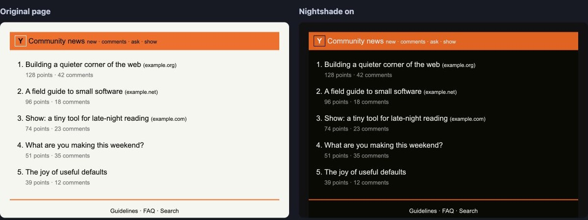
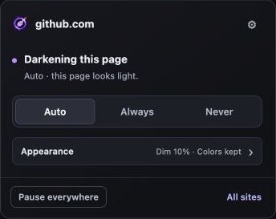
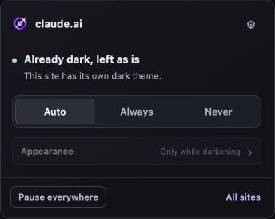
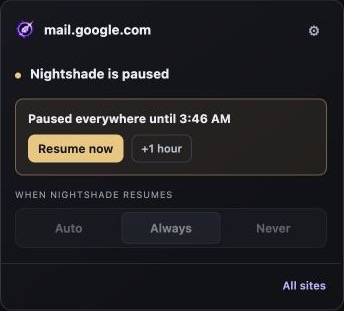
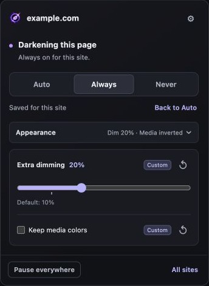
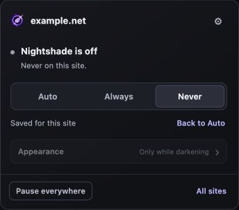
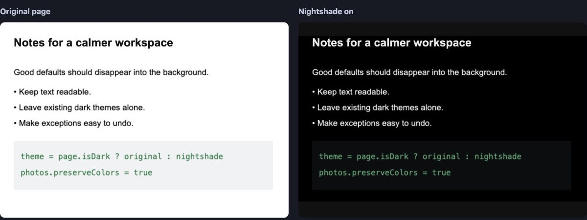

# Nightshade

**Dark mode where it's missing. Leave existing dark themes alone.**

A lightweight Chrome extension with automatic dark-theme detection, per-site controls, and no analytics or server.

## See the difference

## Automatic, with an escape hatch

| Darkens light pages | Detects existing dark themes | Pause everywhere |
| --- | --- | --- |
|  |  |  |
| **Auto** follows your global default. | Native-dark detection avoids double inversion. | Pause for 15 minutes–24 hours; resume early or extend. |

- **Auto / Always / Never:** follow defaults, force dark mode, or exclude a site. Select Auto to undo a mode override.
- **Appearance:** adjust dimming and preserve photo/video colors. Each setting can return to its default independently.
- **All sites:** review saved rules and global defaults. Settings sync through Chrome Sync.
- **Readable details:** special handling for interface icons, mixed-color logos, and Google Docs text canvases.

More screenshots: overrides, appearance, and document rendering

| Custom appearance | Site excluded |
| --- | --- |
|  |  |

| Original page | Nightshade enabled |
| --- | --- |
|  |  |

New captures use synthetic pages and the shipping UI with simulated site states—not private accounts.

## Install

1. Download and extract `nightshade-dark-mode.zip` from [Releases](https://github.com/TimelyToga/nightshade-dark-mode/releases/latest).
2. Open `chrome://extensions` and enable **Developer mode**.
3. Choose **Load unpacked** and select the extracted folder containing `manifest.json`.

Not yet on the Chrome Web Store. To update, replace the files, reload the extension, and refresh open tabs.

## Good to know

Detection is heuristic; use Always or Never when it guesses wrong. Protected Chrome pages cannot be changed. Filters can alter artwork colors—especially images sharing a Docs canvas—and complex sites may need an override.

[Controls & limitations](docs/usage.md) · [Privacy](PRIVACY.md) · [Contributing / build from source](CONTRIBUTING.md) · [Security](SECURITY.md) · [MIT license](LICENSE)
